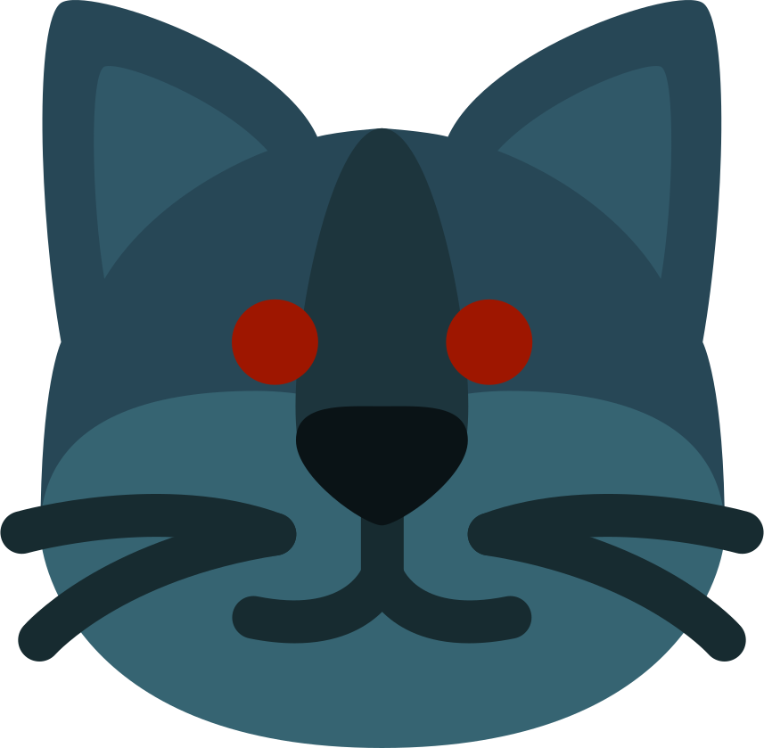

# 

[](https://travis-ci.com/LynnKirby/lynnmoji)
[](LICENSES/CC0-1.0)
[](LICENSES/CC-BY-4.0)

**[Downloads](https://github.com/LynnKirby/lynnmoji/releases) | [Build Instructions](#build) | [Preview](#preview) | [License](#license)**

This repository collects the various emoji I've made so that they aren't hanging
around my hard drive in mysterious locations.

## Build

Graphics processing is coordinated with [Gulp](https://gulpjs.com/):

```
git clone https://github.com/LynnKirby/lynnmoji.git
cd lynnmoji
npm install gulp-cli -g
npm install
gulp
```

## Preview

<!-- PREVIEW SECTION START -->
<table>
  <tr>
    <td><center><h6><code>angry_kiss</code></h6></center></td>
    <td><center><h6><code>confounded_blush</code></h6></center></td>
    <td><center><h6><code>crying_sunglasses</code></h6></center></td>
    <td><center><h6><code>expressionless_thinking</code></h6></center></td>
  </tr>
  <tr>
    <td><center><h6><code>finger_pistol</code></h6></center></td>
    <td><center><h6><code>mae</code></h6></center></td>
    <td><center><h6><code>owo_pistol</code></h6></center></td>
    <td><center><h6><code>owocatboy</code></h6></center></td>
  </tr>
  <tr>
    <td><center><h6><code>owopiratecat</code></h6></center></td>
    <td><center><h6><code>owosneakycat</code></h6></center></td>
    <td><center><h6><code>owosneakycatboy</code></h6></center></td>
    <td><center><h6><code>owothinking</code></h6></center></td>
  </tr>
  <tr>
    <td><center><h6><code>sunglasses_cat</code></h6></center></td>
  </tr>
</table>
<!-- PREVIEW SECTION END -->

## License

Code is distributed under [`CC0-1.0`](LICENSES/CC0-1.0).

Graphics are distributed under [`CC-BY-4.0`](LICENSES/CC-BY-4.0). They include
derivative works from:

* [Twemoji](https://github.com/twitter/twemoji) by Twitter, Inc and other
  contributors
* [MOREmoji](https://moremoji.allezsoyez.com/) by alleZSoyez
